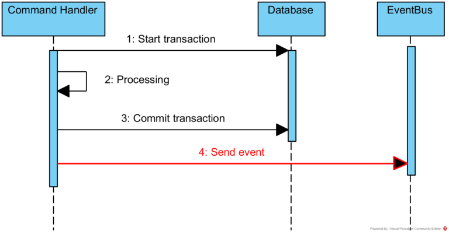
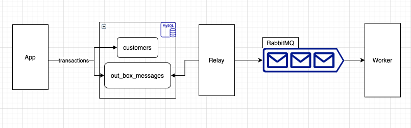

# Golang Outbox pattern example

## Introduction

A service command typically needs to update the database and publish messages/events.

#### Examples:

– sending an e-mail message after placing an order 

– sending an event about new client registration to the messaging system (RabbitMQ, Kafka, ...)

#### Problem:

How to reliably/atomically update the database and publish messages/events?



#### Solution

We should implement the **Outbox Pattern**. A service that uses a relational database inserts messages/events into an outbox table in the same transaction.

## The Outbox Pattern


(image from https://microservices.io)

Outbox Pattern give us [At-Least-Once delivery](https://www.cloudcomputingpatterns.org/at_least_once_delivery/). The receiver application may receive the message more than once.

#### How can a message receiver deal with duplicate messages?

Design a receiver to be an [Idempotent Receiver](https://www.enterpriseintegrationpatterns.com/patterns/messaging/IdempotentReceiver.html)

> The term idempotent is used in mathematics to describe a function that produces the same result if it is applied to itself, i.e. f(x) = f(f(x)). In Messaging this concepts translates into a message that has the same effect whether it is received once or multiple times. This means that a message can safely be resent without causing any problems even if the receiver receives duplicates of the same message.

## How to run example

Example written in Golang, use Mysql as db and RabbitMQ as messaging system

**Note:** This is just a simple solution, the system has thousands of messages per sec should consider a tool like [Debezium](https://debezium.io/)

#### Example Design



Components
1. App: Backend API
2. Relay: Read message from outbox table and publish to RabbitMQ
3. Worker: Doing backgound jobs

#### Build the system

```shell
make build
```

#### Run example

1. Run the infras
```shell
make infras
```

2. Run the app, worker and relay

```shell
make dev
```

3. Cleaning

```shell
make clean
```

4. Send request

```shell
curl -X POST -H "Content-Type: application/json" -d '{"email":"test@example.com","name":"TESTTTTTT"}' http://localhost:3000/customers
```

You will see logs like:

```shell
outbox-demo-relay | 2021/08/04 09:37:16 Published messages: [fcb86b89-9404-48c7-9198-b85585ff8ab2]
```

```shell
outbox-demo-worker | 2021/08/04 09:37:16 Handling [CustomerCreated] - Payload: '{"id":"13db077f-b8b9-4512-9938-04f9aa00cae7","name":"TESTTTTTT","email":"test@example.com","CreatedAt":"2021-08-04T09:37:07.3053179Z","UpdatedAt":"0001-01-01T00:00:00Z"}'
```